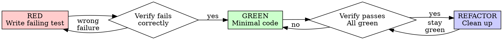

# Right-Sized Testing (TDD when it counts)

## The Principle

**Testing is confidence purchased per unit cost, allocated by risk.**

This is the canonical position, not a shortcut:
- Kent Beck (TDD's creator): *"I get paid for code that works, not for tests, so my philosophy is to test as little as possible to reach a given level of confidence."*
- ISTQB: test effort ∝ likelihood × impact of failure; exhaustive testing is impossible, so sample where failure hurts.
- Google (*Software Engineering at Google*): self-testing code is mandated — any behavior you care about must be pinned by a test (the "Beyoncé rule") — but test-first is optional and coverage-percentage targets are explicitly warned against.

**"Done = proven" is absolute.** What varies by tier is *how* you prove — never *whether*.

## The Rubric — pick the tier before writing code

**Tier `test` — TDD mandatory (red-green-refactor below):**
- **Bug fixes** — a failing test reproducing the bug BEFORE the fix. RED proves the regression exists, GREEN proves the fix. Never fix a bug without one.
- **Complex or error-prone logic** — algorithms, branching conditionals, parsing, money/time/date handling, state machines, concurrency.
- **Contracts others consume** — public APIs, shared services, schemas, exported utilities. Behavior someone else relies on must be pinned.

**Tier `smoke` / `live-proof` — run it, observe it:**
- Wiring, configuration, glue code, UI assembly, generated code.
- Proof = execute in the real context and record the observed result (smoke script output, live check, log line, screenshot). Evidence, not assertion.

**Tier `none` — declared, never silent:**
- Trivial mechanical changes only, with a one-line justification.

Executing a plan? The task's **Verification:** field declares the tier. No plan? Classify yourself and state the tier and why in one line before coding.

## Test Shape

- **Prefer tests that resemble real usage** — integration-shaped, real collaborators, real infra. Mock only at boundaries you don't own (external APIs). *"The more your tests resemble the way your software is used, the more confidence they can give you."*
- **Implementation-detail tests are the waste pattern:** mock-heavy isolation that breaks on every refactor while catching no real bugs. See [testing-anti-patterns.md](testing-anti-patterns.md).
- One behavior per test, clear name describing the behavior, real code.

| Quality | Good | Bad |
|---------|------|-----|
| **Minimal** | One thing. "and" in name? Split it. | `test('validates email and domain and whitespace')` |
| **Clear** | Name describes behavior | `test('test1')` |
| **Shows intent** | Demonstrates desired API | Obscures what code should do |

## Red-Green-Refactor (tier `test` mechanics)



**RED** — one minimal test showing what should happen. **Watch it fail (mandatory, never skip):** confirm it fails (not errors), for the expected reason (feature missing, not a typo). Test passes immediately? You're testing existing behavior — fix the test.

**GREEN** — simplest code to pass. No extra features, no speculative options, no "improving" beyond the test.

**REFACTOR** — after green only: remove duplication, improve names, extract helpers. Stay green.

Wrote tier-`test` code before its test? Write the test now, then temporarily revert or break your change to watch the test fail, then restore. The RED proof is what matters — without it you don't know the test tests anything.

## Hard Guards — never relax, any tier

- **NEVER modify a test to make it pass.** Never weaken an assertion, special-case an expected value, or delete a failing test. A red test means fix the code or fix your understanding — changing the verifier is reward hacking, and it's the documented failure mode of agent coding.
- **Gates and detectors need a negative control:** inject a known failure, prove the gate fires.
- **Deterministic waits only** — signals, queries, `waitFor*`. Never sleep-and-poll.
- **Pristine output:** all tests green, no errors or warnings left behind.
- **Evidence recorded:** whatever the tier, the proof (test run, smoke output, observed result) exists in the transcript — "should work" is not proof.

## Rationalizations

| Excuse | Reality |
|--------|---------|
| "Too simple to test" (on tier-`test` code) | The tier triggers on risk, not on your confidence. Bug fixes and contracts always get tests. |
| "I'll add the test after" (tier `test`) | Tests written after pass immediately and prove nothing. Get the RED first (revert-to-fail if needed). |
| "I'll just adjust the test until it passes" | That's reward hacking. Fix the code or your understanding — never the verifier. |
| "More tests = more quality" | Tests past the confidence threshold are maintenance debt (Beck). Spend where risk lives. |
| "We need X% coverage" | Coverage measures lines executed, not confidence bought. Pin behaviors, not percentages. |
| "Mock everything for proper isolation" | Implementation-detail tests break on refactors and catch nothing real. Test through real usage. |
| "It's just glue, skip verification entirely" | Lighter tier ≠ no tier. Run it, observe it, record it — or declare `none` with justification. |
| "The test is hard to write" | Listen to the test: the design is too coupled. Simplify the interface. |

## Example: Bug Fix (always tier `test`)

**Bug:** empty email accepted.

```typescript
// RED — fails: expected 'Email required', got undefined
test('rejects empty email', async () => {
  const result = await submitForm({ email: '' });
  expect(result.error).toBe('Email required');
});
```

```typescript
// GREEN
function submitForm(data: FormData) {
  if (!data.email?.trim()) {
    return { error: 'Email required' };
  }
  // ...
}
```

Run, watch it pass, refactor if needed. The test is the regression proof and stays forever.

## Verification Checklist (by tier)

- **`test`:** every mandated behavior has a test · watched each fail first, for the right reason · minimal code to green · all tests pass · output pristine.
- **`smoke` / `live-proof`:** ran in its real context · observed result recorded (output, log, screenshot).
- **`none`:** one-line justification written in the task or commit.

## When Stuck

| Problem | Solution |
|---------|----------|
| Don't know how to test | Write the wished-for API. Write the assertion first. Ask your human partner. |
| Test too complicated | Design too complicated. Simplify the interface. |
| Must mock everything | Code too coupled. Use dependency injection, or test one level up. |
| Test setup huge | Extract helpers. Still complex? Simplify the design. |

## Final Rule

```
Tier declared → proof matching the tier → evidence recorded.
No proof → not done.
Modified a test to make it pass → start over.
```
